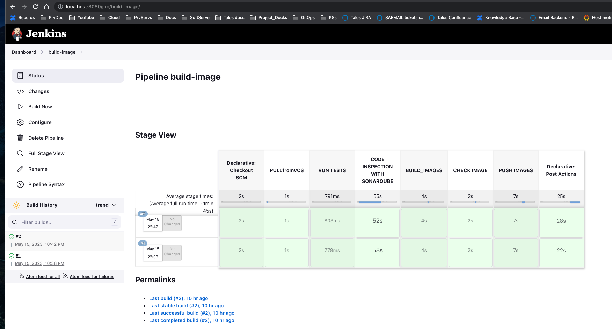
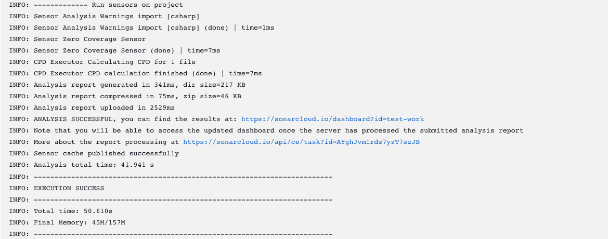
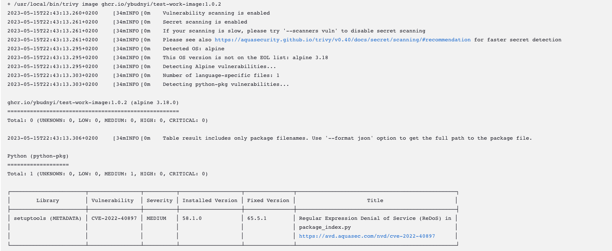
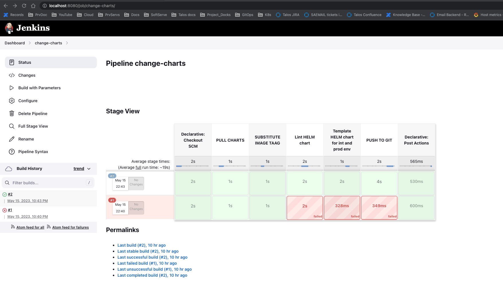
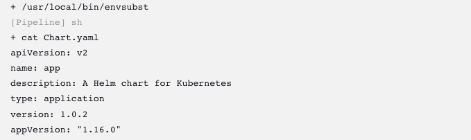
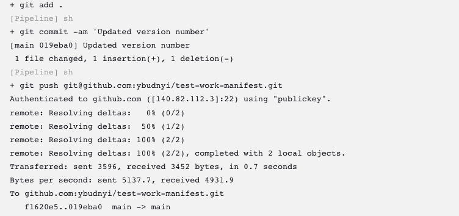
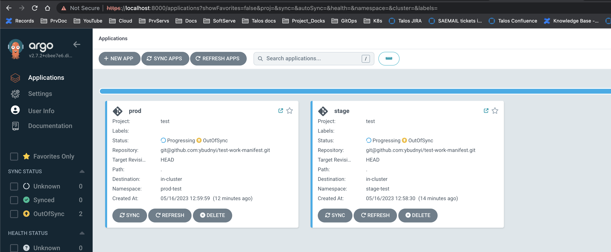
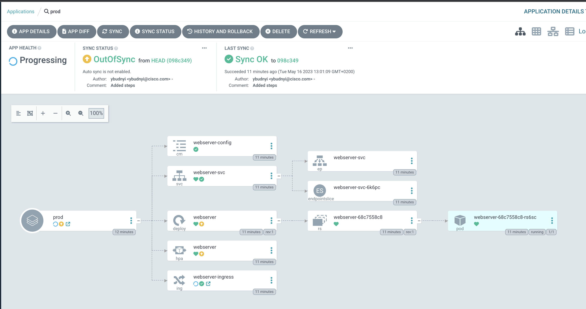
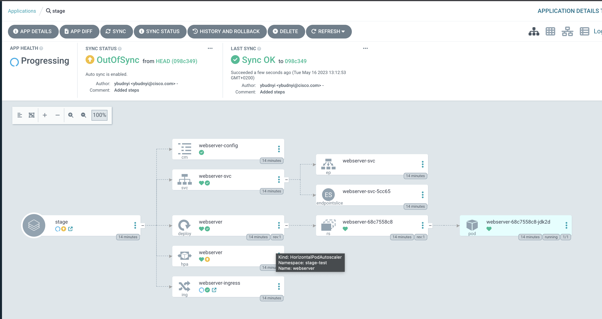
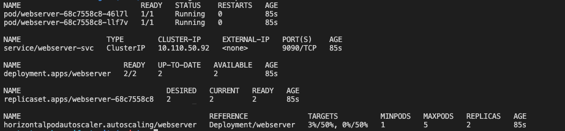

# Pipeline description
### We have two repos. Jenkinsfiles are in root directorys.
### First pipeline in case of succsses build triger second pipeline with parameter (TAG of image):
One for image building, testing, run Sonarcube analyze and security checks with Trivy, and publish image in Github container registry
[First Repo](https://github.com/ybudnyi/test-work-image)

Second for substitute image version in Helm chart, check if Helm chart is corect and push changes to Github
[Second Repo](https://github.com/ybudnyi/test-work-manifest)

After changes are pushed ArgoCD monitor Github repo with Helm chart and if changes are detected new version will be automatically deployed to stage env with auto-sync option enabled and after stage env check we can deploy to prod env.

ArgoCD manifests can be found in argocd directory.
## Screenshoots of first pipeline:

## Screenshoots of second pipeline:

## Screenshoots of ArgoCD application:

## Running pods:

### Docker image test:
docker run -p 9090:9090 -d